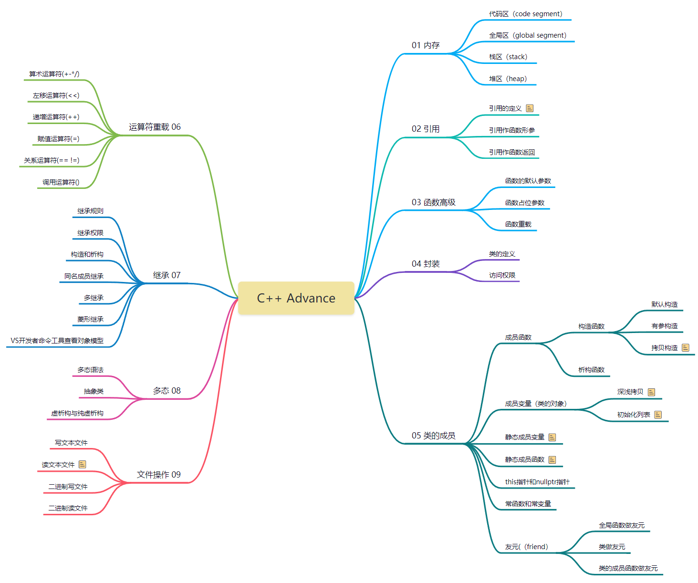

C++ Advance
===
进阶部分介绍C++的三大特性：封装、继承和多态，以及面向对象编程。



## 通过VS开发者工具查看对象模型

### 具体案例

打开开发者工具（如：Developer Command Prompt for VS2019）

输入命令跳转定义类的文件所在磁盘（如C盘）
```
C:
```

进入目标文件所在目录
```
cd C:\Users\UserName\Desktop\C++ Course\2 C++ Advance\07 Inheritance
```

查看目标对象（如'06 diamond.cpp'文件中的Diamond类）
```
cl /d1 reportSingleClassLayoutSheepTuo "06 diamond.cpp"
```

你会看到类似下图的打印信息：


通过这图我们能直观的知道菱形继承的对象模型，并理解为何虚继承能解决菱形继承带来的二义性问题。

## 虚继承解决菱形继承原理：
```
* SheepTuo类分别从两个基类虚继承继承的是两个虚基类指针，而不再是两份具体数据；
* 虚基类指针指向对应的虚基类链表，链表存放的数据是内存偏移；
* 通过虚基类链表数据，两个虚基类指针会指向虚基类Animal中的同一份数据m_age，因此不会带来资源浪费，多继承的二义性也不存在。
* 故：直接访问数据's.m_age'不加作用域也不会报错了！
```