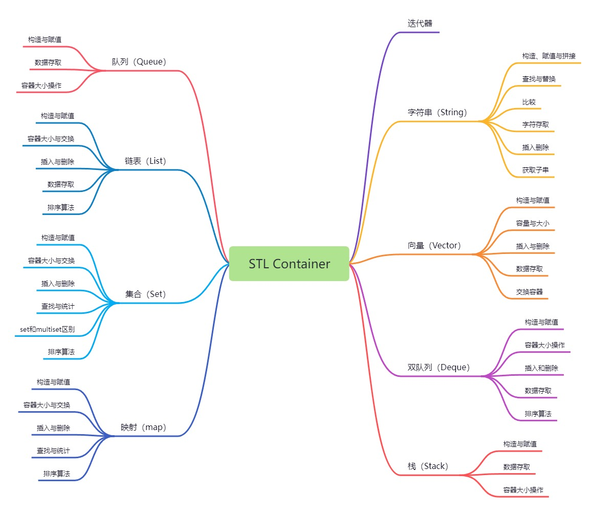

STL Container
===
STL (Standard Template Library,标准模板库) 广义上分为：容器、算法和迭代器。其中STL容器为我们提供了各种数据结构，如vector、list、map等。熟练掌握内置的数据结构非常重要。




## 常用容器简介：

### vector（单端数组）
```
vector 迭代器支持随机访问；
vector 数据结构和数组非常相似，但支持动态扩展；
动态扩展：不是在原空间之后续接新空间，而是找更大的空间（原容量的1.5~2倍）将原数据拷贝过去并释放原空间，因此vector头插头删效率都很低。
```

### deque（双端数组）
```
deque 可以对头端进行插入和删除操作；
deque 迭代器支持随机访问；

deque内部工作原理：
deque内部有个中控器，维护每段缓冲区中的内容，缓冲区中存放真实数据；
中控器维护的是每个缓冲区的地址，使得使用deque时像一片连续的内存空间；
deque相对而言，对头部的插入删除速度会比vector快。
```

### stack（栈容器）
```
stack 先进后出的数据结构，只有一个出口；
栈不允许有遍历行为，因为只有栈顶元素才能被访问。
```

### queue（队列）
```
queue 队列是先进先出的数据结构，它有两个出口；
queue 只允许从一端新增元素，从另一端移除元素；
queue 只有队头和队尾可以被外界访问，因此队列不允许遍历行为。
```

### list（链表）
```
list 是一种物理存储单元上非连续的存储结构，由一系列结点组成；数据元素的逻辑顺序是通过链表中的指针链接实现的.
结点：一个存储数据元素的数据域，另一个是存储下一个结点地址的指针域。

STL中的链表是一个双向循环链表；
双向链表：结点的指针域中不仅存储了下一个结点的地址，还存储了上一个结点的地址；
由于链表的存储方式不是连续的内存空间，因此链表list中的迭代器只支持前移和后移，是双向迭代器。

优点：可以对任意位置进行快速插入或删除元素；采用动态存储分配，不会造成内存浪费和溢出；
缺点：容器遍历速度慢，没有数组快；占用的空间也会比数组大（指针域）；
List重要特性：插入和删除操作都不会造成原有list迭代器的失效，这在vector是不存在的。
```

### set（集合）
```
set 容器插入数据会自动排序，且不允许有重复数据；
set 容器插入只能用insert，没有push和pop的操作。

set/multiset 属于关联式容器，底层结构是用二叉树实现；
两者区别在于：set不允许容器有重复元素；multiset允许容器中有重复的元素。
```

### map（映射）
```
pair中第一个元素为key（键值），起到索引作用；第二个元素为value（实值）。
map 中所有元素都是pair，所有元素会按照key值自动排序。

map/multimap 本质属于关联式容器，底层结构是二叉树实现；优点是可以根据key值快速找到value值。
两者区别：map不允许容器有重复的key值；multimap允许容器有重复的key值.
```