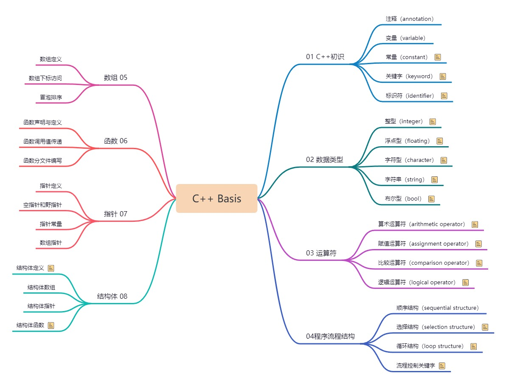
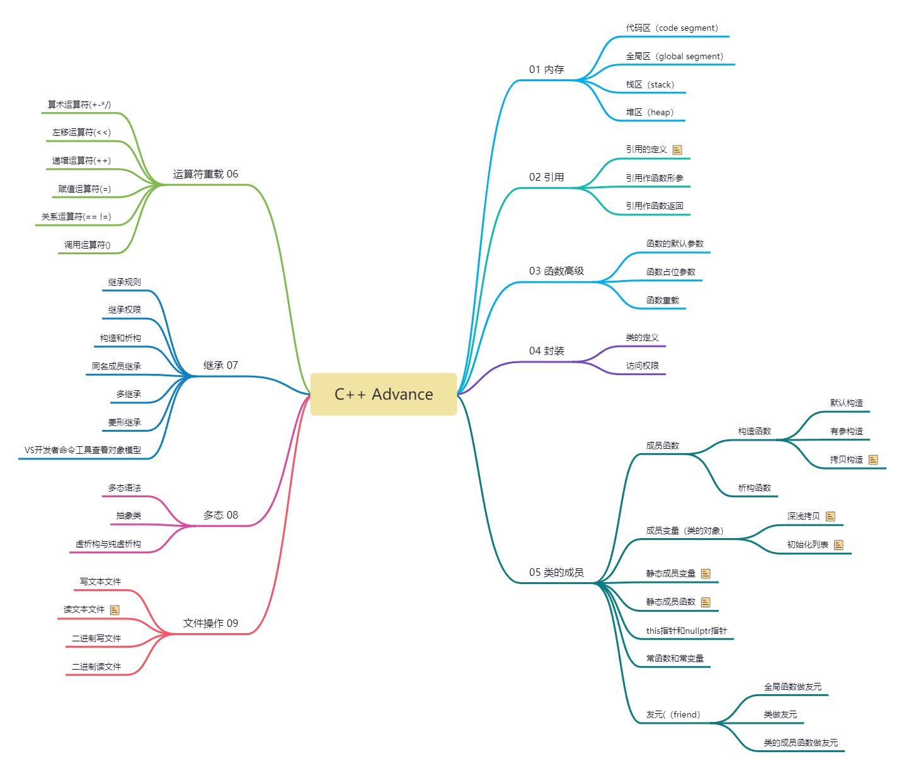
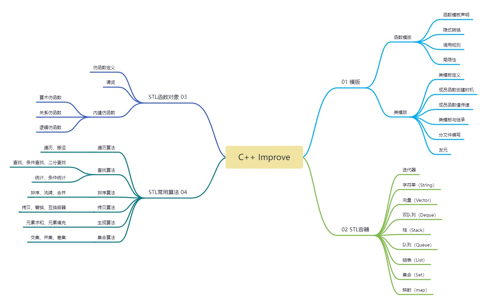

C++ Course
===
C++的课程主要包括三部分：基础知识、进阶部分（面向对象编程）以及提高部分（STL）；

## Basis
基础部分介绍了基本数据类型、运算符、指针等基础知识。



## Advance
进阶部分介绍C++的三大特性：封装、继承和多态，以及面向对象编程。



## Improve
提高部分介绍了泛型编程思想，以及STL容器和Algorithm算法库的使用。



## 注意事项：
```
所有源码开发平台为VS2019；
每一个.cpp文件都有main()函数，为防止重定义部分main()函数改名为main01/main02...;
运行源文件时请注意main()函数命名。
```
